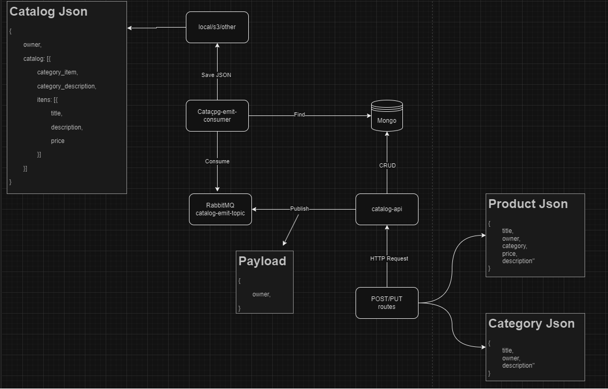

<h1 align="center" > API - Catalogo de Produtos</h1>

<h3> :loudspeaker: O que é o projeto? </h3>
<p>O projeto consiste em desenvolver uma API utilizando Spring para um sistema de controle de catalogos de produtos.</p>

<hr>

<p>As seguintes stories foram convertidas para rotas na aplicação:</p>

- Como usuário, desejo cadastrar um produto junto ao seu proprietário, para futuramente poder acessar seus dados (título, descrição, preço, categoria, ID do proprietário).
- Como usuário, desejo cadastrar uma categoria junto ao seu proprietário, para poder futuramente acessar seus dados (título, descrição, ID do proprietário).
- Como usuário, quero associar um produto a uma categoria.
- Como usuário, desejo atualizar os dados de um produto ou categoria.
- Como usuário, desejo excluir um produto ou categoria do meu catálogo.
- Um produto só pode ser associado a uma categoria por vez.
- Considere o catálogo de produtos como uma compilação JSON de todas as categorias e itens disponíveis de propriedade de um usuário.
  Dessa forma, o endpoint de pesquisa do catálogo não precisa buscar informações no banco de dados.
- Sempre que houver uma alteração no catálogo de produtos, publique essa alteração no tópico "catalog-emit" do Rabbitmq.
- Implemente um consumidor que ouça alterações de catálogo para um proprietário específico.
- Quando o consumidor receber uma mensagem, pesquise no banco de dados o catálogo desse proprietário, gere o JSON do catálogo e publique-o e salve localmente.

<hr>

<h3 id="diagrama"> 📑 Diagrama </h3>



<hr>

<h3 id="sumario"> 📑 Sumário </h3>

- <a href="#requisitos"> Requisitos para rodar o projeto:</a>
  
  - <a href="#rodar-com-docker"> Com Docker.</a>
  - <a href="#rodar-sem-docker"> Sem Docker.</a>
  
- <a href="#como-rodar">Como rodar o projeto:</a>

  - <a href="#rodar-com-docker"> Com Docker.</a>
  - <a href="#rodar-sem-docker"> Sem Docker.</a>
- <a href="#tecnologias">Tecnologias e recursos utilizadas no projeto.</a>

<hr>

<h3 id="requisitos"> 🧾 Requisitos para rodar o projeto</h3>

<h4 id="requisitos-com-docker"> Com Docker:</h4> 

- <a target="_blank" href="https://maven.apache.org/">Maven</a>
- <a target="_blank" href="https://openjdk.java.net/install/">Java 17</a>
- <a target="_blank" href="https://docs.docker.com/engine/install/">Docker</a>
- <a target="_blank" href="https://docs.docker.com/compose/install/">Docker Compose</a>

<h4 id="requisitos-sem-docker"> Sem Docker:</h4>

- <a target="_blank" href="https://maven.apache.org/">Maven</a>
- <a target="_blank" href="https://openjdk.java.net/install/">Java 17</a>
- <a target="_blank" href="https://openjdk.java.net/install/">Mongo Database</a>
- <a target="_blank" href="https://rabbitmq.com/">RabbitMQ</a>

<hr>

<h3 id="como-rodar"> 🏗️ Rodar o projeto</h3>

<h4 id="rodar-com-docker"> Com Docker:</h4> 

- Gere o <b>.jar</b> da aplicação executando o comando no terminal:
    ```shell
    mvn clean install -Dskiptests
    ```

- Instancie e rode os containers executando o comando no terminal:
    ```shell
    docker-compose up --build --force-recreate
    ```

<h4 id="rodar-sem-docker"> Sem Docker:</h4> 

- Gere o <b>.jar</b> da aplicação executando o comando no terminal:
    ```shell
    mvn clean install -Dskiptests
    ```

- Para rodar o <b>.jar</b> vá até a pasta do projeto pelo terminal e rode o comando:
    ```shell
    java -jar desafio-anotai-0.0.1-SNAPSHOT.jar
     ```

<h3 id="tecnologias"> 🚀 Tecnologias e recursos utilizadas no projeto</h3>

- Java 17
- Banco de Dados Mongo
- Docker
- Docker Compose
- Spring Web
- RabbitMQ 
- AMQP
- Mensageria
<hr>